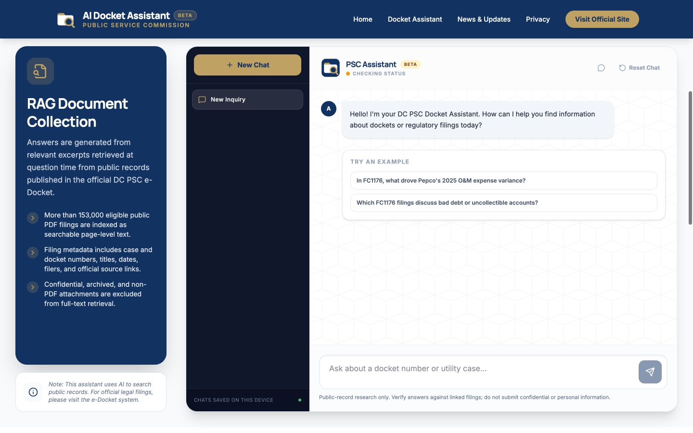

# PSC Docket Helper

An independent beta AI assistant for exploring District of Columbia Public Service Commission dockets, regulatory filings, and public records.

## Try the Website

### [Open the PSC Docket Helper](https://psc-docket-assistant.psc-docket-helper.workers.dev/)

[](https://psc-docket-assistant.psc-docket-helper.workers.dev/#docket-chat)

*The Docket Assistant searches indexed public filings and links answers back to official sources. Click the screenshot to open the live chat.*

No installation is required.

> Public filing metadata, official links, and nearly all available PDF full text have been indexed. A small number of unavailable or image-only filings may still lack searchable text. Current corpus and global-router coverage are available from the [health endpoint](https://psc-docket-assistant.psc-docket-helper.workers.dev/api/health).

## What It Does

- Searches inside indexed public filing PDFs, not just filing titles.
- Answers filing-content questions with document names, PDF page numbers, and official links.
- Retrieves current notices and regulatory news from the official DCPSC website.
- Keeps separate chat sessions in the user's browser.
- Publishes corpus freshness and coverage through a fail-closed health endpoint.
- Protects the production chat API with request limits, Cloudflare rate limiting, and Turnstile.

## Questions That Work Well

- `In FC1176, what drove Pepco's 2025 O&M expense variance?`
- `Which FC1176 filings discuss bad debt or uncollectible accounts?`

## Questions That Work Partially

- `Which DC PSC cases discuss bad debt or uncollectible accounts?`

Questions with a case number search that case directly, and this is the path the tool does best.

Questions without a case number use the global case router. It currently scans one of sixteen router partitions, so it examines a sample of indexed cases rather than the whole corpus, and which sample it reads shifts with how the question is worded. Relevant proceedings may be missing. Treat cross-case answers as leads to confirm with a case-specific question or the official e-Docket search, not as a complete list.

## How It Works

Public filing metadata and official links are published first. Four non-overlapping ingestion shards then download PDFs temporarily, convert them into searchable page-level text, and store gzip-compressed, text-only HTML in Cloudflare R2. PDF images, embedded fonts, and layout data are not retained. Sharded per-case manifests hold metadata and search filters without concurrent-write conflicts. A free 16-part R2 case router supports corpus-wide questions without a paid vector database. The Worker verifies exact matches against stored text before OpenAI prepares an answer, and every citation links back to the official PDF.

The original PDFs are not permanently duplicated in project storage. Scheduled ingestion processes one shard at a time, resumes from its previous checkpoint, and stops cleanly at conservative Cloudflare free-plan safety limits.

## Run Locally

Requirements: Node.js, npm, and an OpenAI API key for synthesized answers.

```bash
npm install
export OPENAI_API_KEY="your_api_key_here"
npm run dev
```

Open [http://localhost:3000](http://localhost:3000).

## Technical Documentation

- [Architecture and RAG design](docs/ARCHITECTURE.md)
- [Deployment, ingestion, and operations](docs/OPERATIONS.md)
- [Industry beta release checklist](docs/RELEASE_CHECKLIST.md)

The main stack is React, TypeScript, Vite, Cloudflare Workers, D1, R2, and the OpenAI Responses API. An Express server remains available for local development and as a Render-compatible fallback.

## Sources and Disclaimer

News is retrieved from [DCPSC Current PSC News](https://dcpsc.org/Newsroom/Current-PSC-News.aspx). Filing metadata and documents come from the public [DC PSC e-Docket](https://edocket.dcpsc.org/public/search).

This project is not affiliated with or endorsed by the Public Service Commission of the District of Columbia. It is an experimental research tool, not legal advice or an official agency record. Verify important information against the original filing or the [official DCPSC website](https://dcpsc.org/).

Conversation history is stored in the user's browser. A question, up to ten recent messages, and relevant public filing excerpts may be sent to OpenAI through Cloudflare AI Gateway to generate an answer. Do not submit confidential, privileged, proprietary, personal, or other non-public information.
